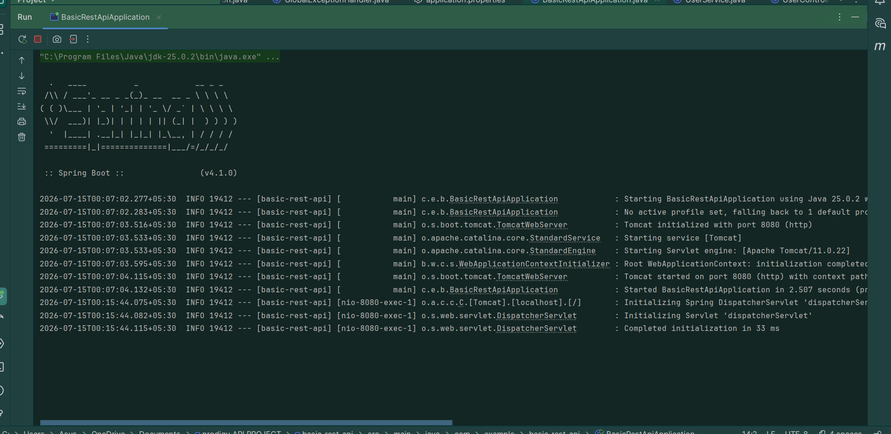
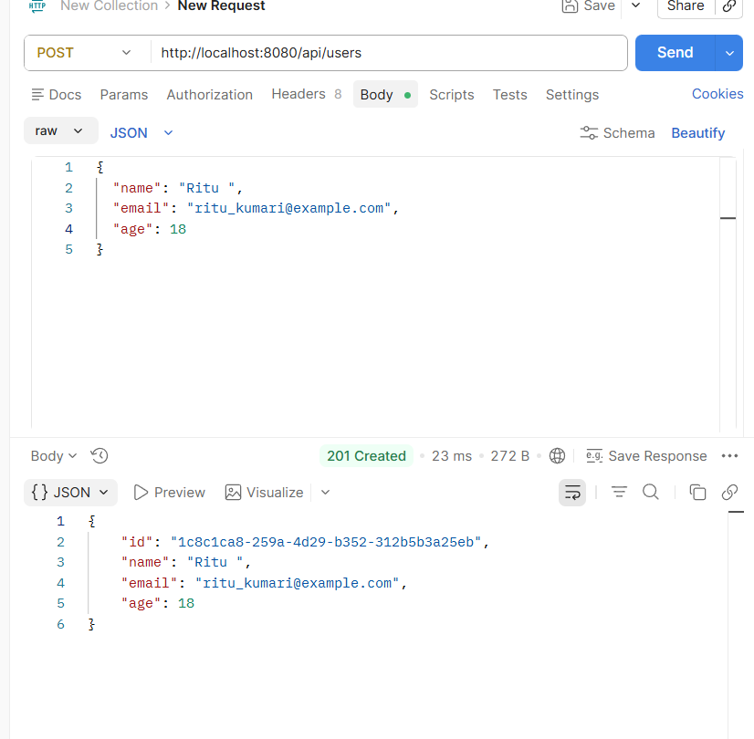
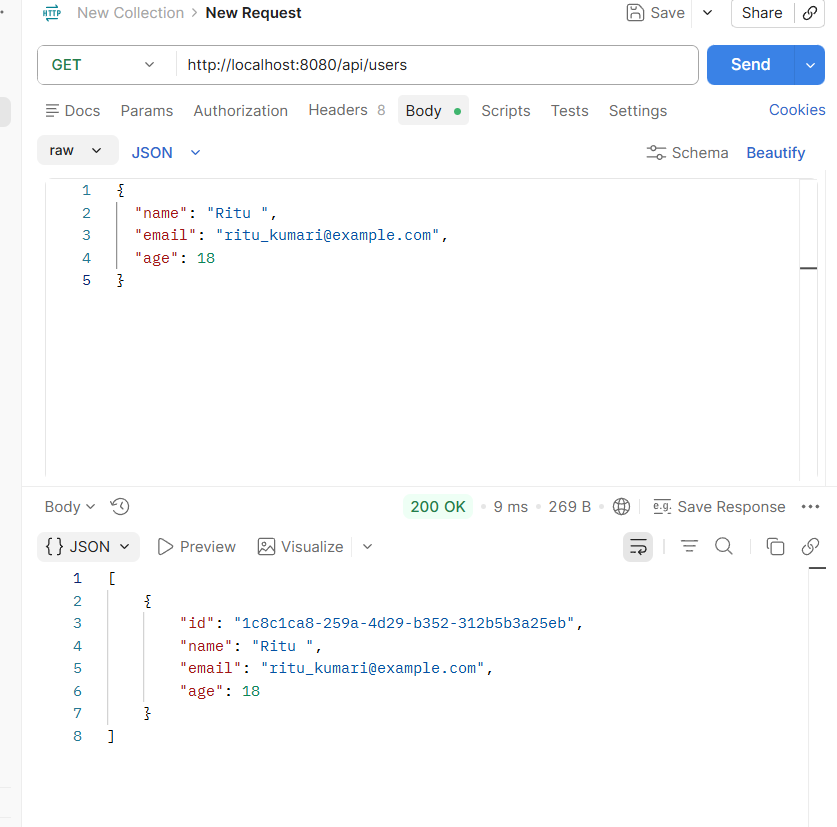
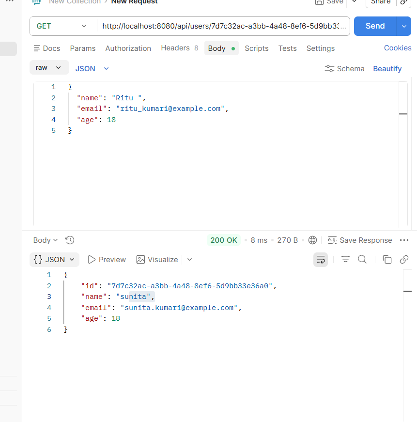
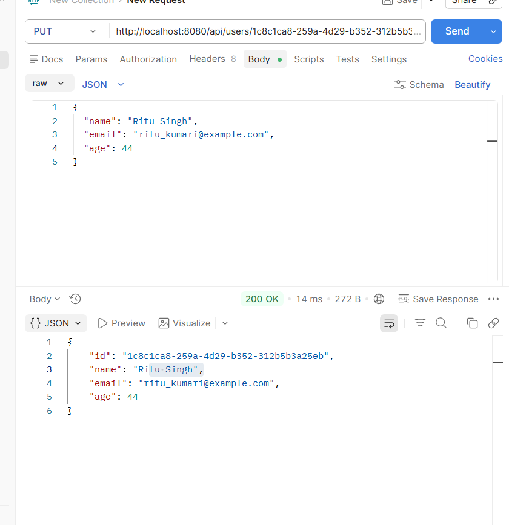
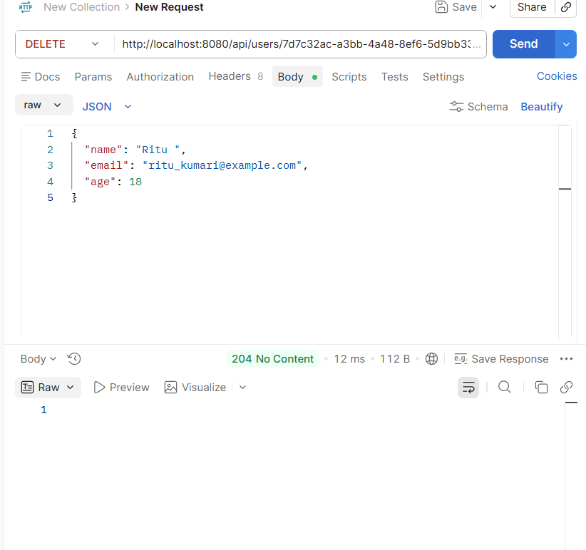
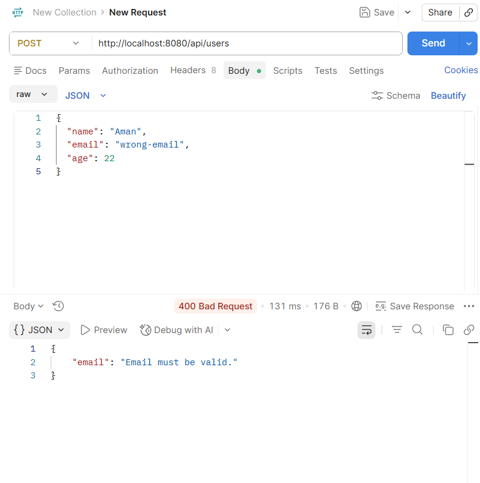
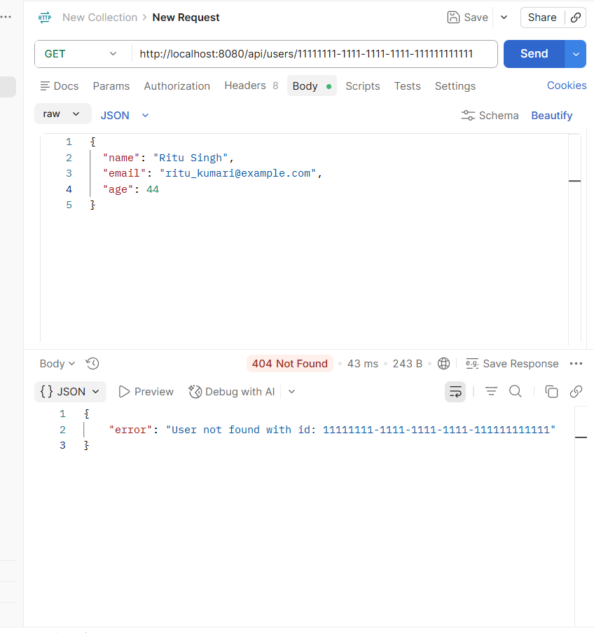

# Basic REST API with CRUD Operations

A Spring Boot REST API for managing users. The application supports Create, Read, Update, and Delete (CRUD) operations, validates request input, uses UUID identifiers, and stores data in memory with a `HashMap`.

## Features

- Create, list, retrieve, update, and delete users
- UUID generated for each user
- User fields: `id`, `name`, `email`, and `age`
- In-memory storage with `HashMap<UUID, User>`
- Request validation for name, email, and age
- Clear HTTP responses: `201`, `200`, `204`, `400`, and `404`

## Tech Stack

- Java 21
- Spring Boot 4.1.0
- Maven
- Spring Web MVC
- Jakarta Bean Validation
- Postman (API testing)

## Project Structure

```text
src/main/java/com/example/basic_rest_api/
├── controller/UserController.java          # REST endpoints
├── dto/UserRequest.java                    # Validated request body
├── exception/GlobalExceptionHandler.java   # 400 and 404 error responses
├── exception/UserNotFoundException.java
├── model/User.java                          # User entity/model
├── service/UserService.java                 # Business logic and HashMap storage
└── BasicRestApiApplication.java             # Application entry point
```

## Prerequisites

- JDK 21 or later
- IntelliJ IDEA (recommended)
- Postman (optional, for testing)

## Run Locally

1. Clone or download this repository.
2. Open the `basic-rest-api` folder in IntelliJ IDEA.
3. Allow Maven to download dependencies.
4. Run `BasicRestApiApplication` from IntelliJ, or use the command below from the project folder:

```powershell
.\mvnw.cmd spring-boot:run
```

5. The server starts on:

```text
http://localhost:8080
```

> The API uses in-memory storage. All users are removed when the application is restarted.

## API Endpoints

| Method | Endpoint | Description | Success status |
|---|---|---|---|
| `POST` | `/api/users` | Create a user | `201 Created` |
| `GET` | `/api/users` | Get all users | `200 OK` |
| `GET` | `/api/users/{id}` | Get one user by UUID | `200 OK` |
| `PUT` | `/api/users/{id}` | Update a user | `200 OK` |
| `DELETE` | `/api/users/{id}` | Delete a user | `204 No Content` |

### Request body for create and update

```json
{
  "name": "Ritu Singh",
  "email": "ritu.kumari@example.com",
  "age": 44
}
```

### Validation and errors

| Situation | Status | Example response |
|---|---|---|
| Invalid email or missing/invalid input | `400 Bad Request` | `{ "email": "Email must be valid." }` |
| User UUID does not exist | `404 Not Found` | `{ "error": "User not found with id: ..." }` |

## Application Running

The Spring Boot server successfully starts on port `8080`.



## API Test Evidence

### 1. Create user — `POST /api/users`

Creates a user and generates a UUID. Returns `201 Created`.



### 2. Get all users — `GET /api/users`

Returns all users currently in the in-memory store with `200 OK`.



### 3. Get user by ID — `GET /api/users/{id}`

Returns one user identified by UUID with `200 OK`.



### 4. Update user — `PUT /api/users/{id}`

Updates the user's name, email, and age. Returns `200 OK`.



### 5. Delete user — `DELETE /api/users/{id}`

Deletes the requested user. Returns `204 No Content`.



### 6. Invalid input — `400 Bad Request`

An invalid email address is rejected by request validation.



### 7. User not found — `404 Not Found`

Requesting a UUID that does not exist returns a clear error message.



## Author

Udisha Singh
